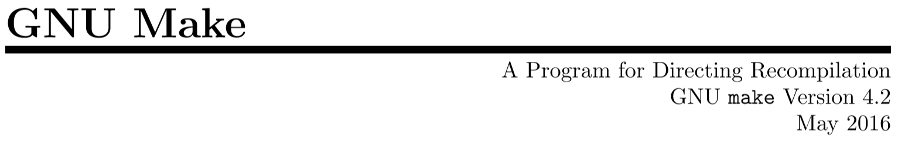
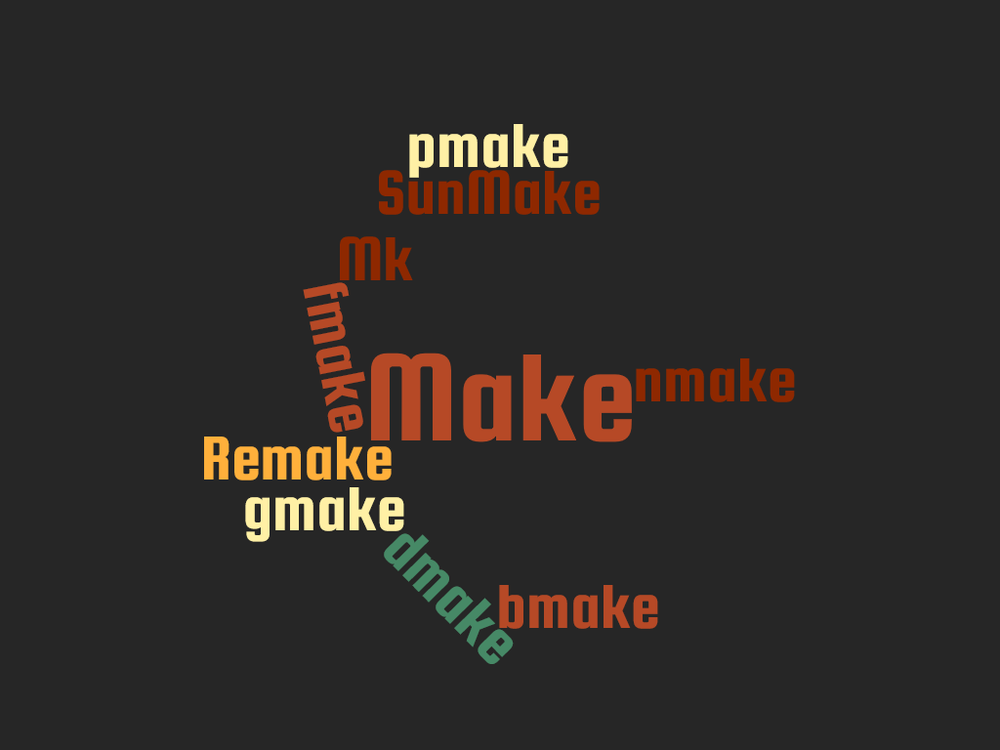
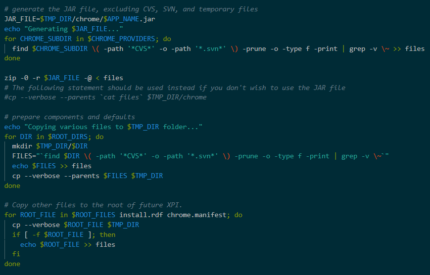
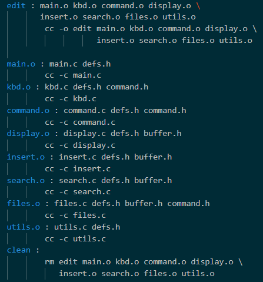

# $(Make) 
Is Probably Enough


## What Is It

- build automation tool
- THE build tool in classic Linux world
- e.g. builds the Linux Kernel

Note: there since the late 1970ies 


## We Talk About




## It is always there

```shell
$ make
make: *** No targets specified and no makefile found.  Stop.
```

Note: belongs to the DNA of Linux


## Long History

  <!-- .element height="60%" width="60%" -->


## Instead of custom shell scripts...

  <!-- .element height="60%" width="60%" -->


## ...It Provides A Standard Structure

  <!-- .element height="40%" width="40%" -->


_Makefiles were text files, not magically encoded binaries, because that was the Unix ethos: printable, debuggable, understandable stuff._

by Stuart Feldman, creator of Make


## External 3.2

Content 3.2


## External 3.3


Note: This will only appear in the speaker notes window.
